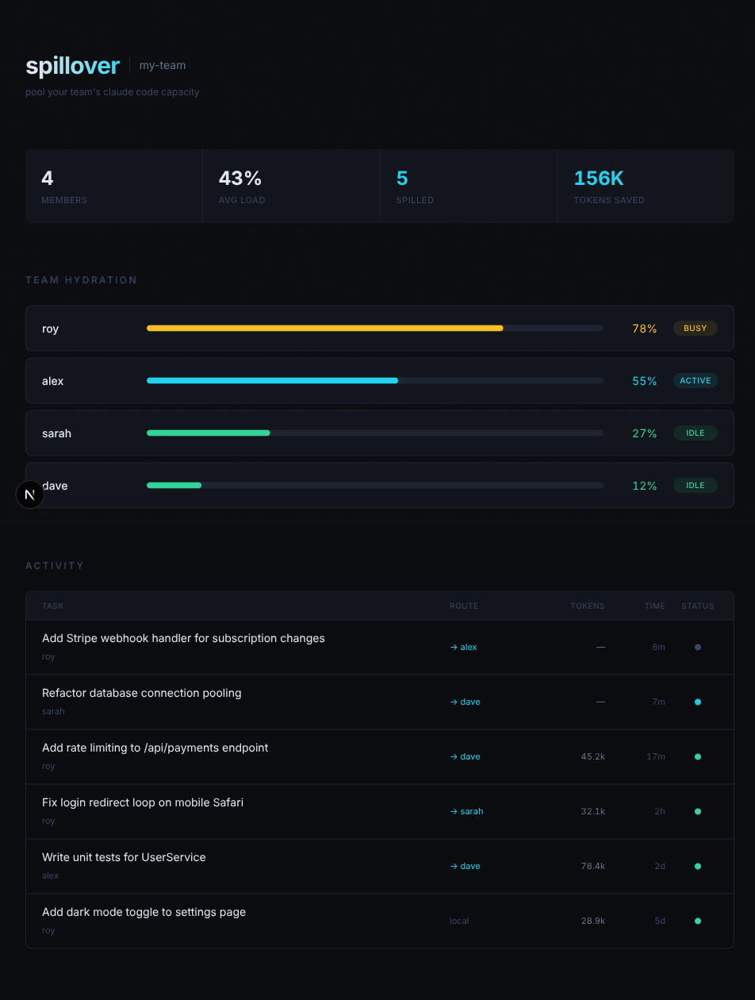

# spillover

Pool your team's Claude Code capacity. No tokens left behind.

**Dashboard**: [spillover-app.vercel.app](https://spillover-app.vercel.app)



## What it does

Your team pays for Claude Code subscriptions. Some devs hit their limits while others barely use theirs. Spillover automatically routes tasks to teammates with spare capacity — using GitHub issues as the task queue.

## How it works

1. Link your GitHub repos to a spillover project
2. Label any issue with `spillover` to queue it
3. An agent with spare capacity picks it up, runs Claude Code, and pushes a result branch

```
$ spillover status

  team hydration check

  @roy      ████████░░  78%  — running warm
  @sarah    ███░░░░░░░  27%  — plenty to give
  @dave     █░░░░░░░░░  12%  — overflowing

  team capacity: 61% available

$ spillover run "add rate limiting to /api/payments" --repo team/app

  Created issue #42 on team/app
  An agent will pick this up when it has spare capacity.
```

## Quick start

```bash
# Install
npm i -g spillover

# Create a project
spillover init my-team

# Authenticate with GitHub (opens browser)
spillover login

# Start the agent (picks up spillover-labeled issues)
spillover agent
```

## Dashboard

Sign in at [spillover-app.vercel.app](https://spillover-app.vercel.app) to:

- See team capacity (who's busy, who has spare tokens)
- Link GitHub repos to your project
- Browse and queue issues (adds the `spillover` label)
- Track issue status and agent progress
- Invite teammates via shareable link

## Architecture

```
packages/
├── cli/          # CLI tool (npm: spillover)
├── web/          # Dashboard (Next.js 16)
└── shared/       # Shared types
supabase/         # Database migrations
```

## Stack

- **CLI**: Node.js + TypeScript + Commander
- **Database**: Neon (serverless Postgres)
- **Dashboard**: Next.js + Tailwind CSS
- **Auth**: NextAuth.js with GitHub OAuth
- **Task queue**: GitHub issues with `spillover` label
- **Task execution**: Claude Code headless (`claude -p`)
